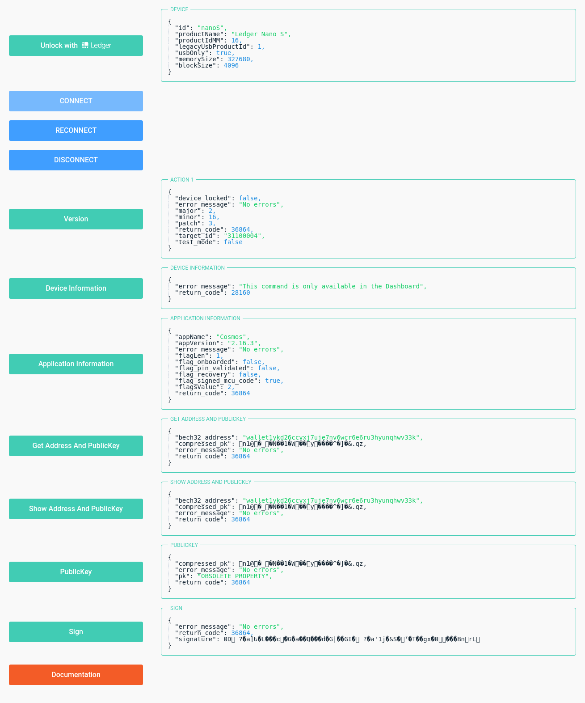

<!-- START doctoc generated TOC please keep comment here to allow auto update -->
<!-- DON'T EDIT THIS SECTION, INSTEAD RE-RUN doctoc TO UPDATE -->


  - [ledger-app-cosmos](#ledger-app-cosmos)
  - [Installation](#installation)
  - [Demo](#demo)
  - [Documentation](#documentation)
  - [Screenshot](#screenshot)
- [Classes](#classes)
  - [Class: Cosmos](#class-cosmos)
    - [Table of contents](#table-of-contents)
    - [Constructors](#constructors)
    - [Properties](#properties)
    - [Accessors](#accessors)
    - [Methods](#methods)
  - [Class: Ledger](#class-ledger)
    - [Hierarchy](#hierarchy)
    - [Table of contents](#table-of-contents-1)
    - [Constructors](#constructors-1)
    - [Properties](#properties-1)
    - [Accessors](#accessors-1)
    - [Methods](#methods-1)
- [Enums](#enums)
  - [Enumeration: EVENTS](#enumeration-events)
    - [Table of contents](#table-of-contents-2)
    - [Enumeration members](#enumeration-members)
- [ledger-app-cosmos](#ledger-app-cosmos-1)
  - [Table of contents](#table-of-contents-3)
    - [Enumerations](#enumerations)
    - [Classes](#classes-1)
    - [Type aliases](#type-aliases)
    - [Variables](#variables)
  - [Type aliases](#type-aliases-1)
    - [APK](#apk)
    - [ApplicationInformation](#applicationinformation)
    - [Device](#device)
    - [DeviceInformation](#deviceinformation)
    - [Exception](#exception)
    - [LedgerOptions](#ledgeroptions)
    - [Model](#model)
    - [PK](#pk)
    - [Signature](#signature)
    - [Version](#version)
  - [Variables](#variables-1)
    - [Ledgerer](#ledgerer)

<!-- END doctoc generated TOC please keep comment here to allow auto update -->


<a name="readmemd"></a>

ledger-app-cosmos / [Exports](#modulesmd)

## ledger-app-cosmos

#### TypeScript/JavaScript client library to communicate with a Tendermint/Cosmos App running in a Ledger Nano S/X

## Installation

Install with [npm](https://www.npmjs.com):

```sh
$ npm install --save ledger-app-cosmos
```

Install with [yarn](https://yarnpkg.com):

```sh
$ yarn add ledger-app-cosmos
```

## [Demo](https://ledger-app-cosmos.netlify.app/)

#### [Try online demo](https://ledger-app-cosmos.netlify.app/)

## [Documentation](https://www.npmjs.com/package/ledger-app-cosmos)

#### [Try online documentation](https://www.npmjs.com/package/ledger-app-cosmos)

## Screenshot



# Classes


<a name="classescosmosmd"></a>

[ledger-app-cosmos](#readmemd) / [Exports](#modulesmd) / Cosmos

## Class: Cosmos

[[include:cosmos/properties.md]]

[[include:installation.md]]

[[include:cosmos/usage.md]]

[[include:cosmos/demo.md]]

### Table of contents

#### Constructors

- [constructor](#constructor)

#### Properties

- [scrambleKey](#scramblekey)

#### Accessors

- [transport](#transport)

#### Methods

- [debug](#debug)
- [getAddressAndPublicKey](#getaddressandpublickey)
- [getApplicationInformation](#getapplicationinformation)
- [getBech32FromPK](#getbech32frompk)
- [getDeviceInformation](#getdeviceinformation)
- [getPublicKey](#getpublickey)
- [getVersion](#getversion)
- [serializeHRP](#serializehrp)
- [serializePath](#serializepath)
- [showAddressAndPubKey](#showaddressandpubkey)
- [sign](#sign)

### Constructors

#### constructor

• **new Cosmos**(`transport`, `scrambleKey?`)

##### Parameters

| Name | Type |
| :------ | :------ |
| `transport` | `default` |
| `scrambleKey` | `string` |

##### Defined in

[src/lib/cosmos/index.ts:71](https://github.com/dfinance/ledger/blob/b96f748/src/lib/cosmos/index.ts#L71)

### Properties

#### scrambleKey

• `Readonly` **scrambleKey**: `string`

### Accessors

#### transport

• `get` **transport**(): `default`

##### Returns

`default`

##### Defined in

[src/lib/cosmos/index.ts:94](https://github.com/dfinance/ledger/blob/b96f748/src/lib/cosmos/index.ts#L94)

• `set` **transport**(`transport`): `void`

##### Parameters

| Name | Type |
| :------ | :------ |
| `transport` | `default` |

##### Returns

`void`

##### Defined in

[src/lib/cosmos/index.ts:98](https://github.com/dfinance/ledger/blob/b96f748/src/lib/cosmos/index.ts#L98)

### Methods

#### debug

▸ **debug**(`debug`): `void`

##### Parameters

| Name | Type |
| :------ | :------ |
| `debug` | `boolean` |

##### Returns

`void`

##### Defined in

[src/lib/cosmos/index.ts:82](https://github.com/dfinance/ledger/blob/b96f748/src/lib/cosmos/index.ts#L82)

___

#### getAddressAndPublicKey

▸ **getAddressAndPublicKey**(`path`, `hrp`, `p1?`, `p2?`): `Promise`<[`APK`](#apk)\>

##### Parameters

| Name | Type | Default value |
| :------ | :------ | :------ |
| `path` | `string` \| `number`[] | `undefined` |
| `hrp` | `string` | `undefined` |
| `p1` | `number` | `undefined` |
| `p2` | `number` | `0` |

##### Returns

`Promise`<[`APK`](#apk)\>

##### Defined in

[src/lib/cosmos/index.ts:367](https://github.com/dfinance/ledger/blob/b96f748/src/lib/cosmos/index.ts#L367)

___

#### getApplicationInformation

▸ **getApplicationInformation**(): `Promise`<[`ApplicationInformation`](#applicationinformation)\>

##### Returns

`Promise`<[`ApplicationInformation`](#applicationinformation)\>

##### Defined in

[src/lib/cosmos/index.ts:190](https://github.com/dfinance/ledger/blob/b96f748/src/lib/cosmos/index.ts#L190)

___

#### getBech32FromPK

▸ **getBech32FromPK**(`hrp`, `pk`): `string`

##### Parameters

| Name | Type |
| :------ | :------ |
| `hrp` | `string` |
| `pk` | `Buffer` |

##### Returns

`string`

##### Defined in

[src/lib/cosmos/index.ts:143](https://github.com/dfinance/ledger/blob/b96f748/src/lib/cosmos/index.ts#L143)

___

#### getDeviceInformation

▸ **getDeviceInformation**(): `Promise`<[`DeviceInformation`](#deviceinformation)\>

##### Returns

`Promise`<[`DeviceInformation`](#deviceinformation)\>

##### Defined in

[src/lib/cosmos/index.ts:257](https://github.com/dfinance/ledger/blob/b96f748/src/lib/cosmos/index.ts#L257)

___

#### getPublicKey

▸ **getPublicKey**(`path`): `Promise`<[`PK`](#pk)\>

##### Parameters

| Name | Type |
| :------ | :------ |
| `path` | `string` \| `number`[] |

##### Returns

`Promise`<[`PK`](#pk)\>

##### Defined in

[src/lib/cosmos/index.ts:339](https://github.com/dfinance/ledger/blob/b96f748/src/lib/cosmos/index.ts#L339)

___

#### getVersion

▸ **getVersion**(`force?`): `Promise`<[`Version`](#version)\>

##### Parameters

| Name | Type | Default value |
| :------ | :------ | :------ |
| `force` | `boolean` | `true` |

##### Returns

`Promise`<[`Version`](#version)\>

##### Defined in

[src/lib/cosmos/index.ts:174](https://github.com/dfinance/ledger/blob/b96f748/src/lib/cosmos/index.ts#L174)

___

#### serializeHRP

▸ **serializeHRP**(`hrp`): `Buffer`

##### Parameters

| Name | Type |
| :------ | :------ |
| `hrp` | `string` |

##### Returns

`Buffer`

##### Defined in

[src/lib/cosmos/index.ts:128](https://github.com/dfinance/ledger/blob/b96f748/src/lib/cosmos/index.ts#L128)

___

#### serializePath

▸ **serializePath**(`path`): `Promise`<`Buffer`\>

##### Parameters

| Name | Type |
| :------ | :------ |
| `path` | `string` \| readonly `number`[] |

##### Returns

`Promise`<`Buffer`\>

##### Defined in

[src/lib/cosmos/index.ts:157](https://github.com/dfinance/ledger/blob/b96f748/src/lib/cosmos/index.ts#L157)

___

#### showAddressAndPubKey

▸ **showAddressAndPubKey**(`path`, `hrp`, `p1?`, `p2?`): `Promise`<[`APK`](#apk)\>

##### Parameters

| Name | Type | Default value |
| :------ | :------ | :------ |
| `path` | `string` \| `number`[] | `undefined` |
| `hrp` | `string` | `undefined` |
| `p1` | `number` | `undefined` |
| `p2` | `number` | `0` |

##### Returns

`Promise`<[`APK`](#apk)\>

##### Defined in

[src/lib/cosmos/index.ts:405](https://github.com/dfinance/ledger/blob/b96f748/src/lib/cosmos/index.ts#L405)

___

#### sign

▸ **sign**(`path`, `data`, `size?`): `Promise`<[`Signature`](#signature)\>

##### Parameters

| Name | Type |
| :------ | :------ |
| `path` | `string` \| `number`[] |
| `data` | `any` |
| `size` | `number` |

##### Returns

`Promise`<[`Signature`](#signature)\>

##### Defined in

[src/lib/cosmos/index.ts:414](https://github.com/dfinance/ledger/blob/b96f748/src/lib/cosmos/index.ts#L414)


<a name="classesledgermd"></a>

[ledger-app-cosmos](#readmemd) / [Exports](#modulesmd) / Ledger

## Class: Ledger

[[include:ledgerer/properties.md]]

[[include:installation.md]]

[[include:ledgerer/usage.md]]

[[include:ledgerer/demo.md]]

### Hierarchy

- `EventEmitter`

  ↳ **`Ledger`**

### Table of contents

#### Constructors

- [constructor](#constructor)

#### Properties

- [EVENTS](#events)
- [error](#error)
- [isConnecting](#isconnecting)
- [isDisconnecting](#isdisconnecting)
- [EVENTS](#events)
- [captureRejectionSymbol](#capturerejectionsymbol)
- [captureRejections](#capturerejections)
- [defaultMaxListeners](#defaultmaxlisteners)
- [errorMonitor](#errormonitor)

#### Accessors

- [cosmos](#cosmos)
- [device](#device)
- [model](#model)
- [transport](#transport)
- [instance](#instance)

#### Methods

- [addListener](#addlistener)
- [connect](#connect)
- [debug](#debug)
- [disconnect](#disconnect)
- [emit](#emit)
- [eventNames](#eventnames)
- [getAddressAndPublicKey](#getaddressandpublickey)
- [getApplicationInformation](#getapplicationinformation)
- [getBech32FromPK](#getbech32frompk)
- [getDeviceInformation](#getdeviceinformation)
- [getMaxListeners](#getmaxlisteners)
- [getPublicKey](#getpublickey)
- [getVersion](#getversion)
- [listenerCount](#listenercount)
- [listeners](#listeners)
- [off](#off)
- [on](#on)
- [once](#once)
- [prependListener](#prependlistener)
- [prependOnceListener](#prependoncelistener)
- [rawListeners](#rawlisteners)
- [reconnect](#reconnect)
- [removeAllListeners](#removealllisteners)
- [removeListener](#removelistener)
- [serializeHRP](#serializehrp)
- [serializePath](#serializepath)
- [setMaxListeners](#setmaxlisteners)
- [showAddressAndPubKey](#showaddressandpubkey)
- [sign](#sign)
- [transporter](#transporter)
- [u2f](#u2f)
- [webBle](#webble)
- [webHID](#webhid)
- [webUSB](#webusb)
- [getEventListeners](#geteventlisteners)
- [listenerCount](#listenercount)
- [on](#on)
- [once](#once)

### Constructors

#### constructor

• **new Ledger**(`options?`)

##### Parameters

| Name | Type |
| :------ | :------ |
| `options` | [`LedgerOptions`](#ledgeroptions) |

##### Overrides

events.EventEmitter.constructor

##### Defined in

[src/lib/Ledger.ts:123](https://github.com/dfinance/ledger/blob/b96f748/src/lib/Ledger.ts#L123)

### Properties

#### EVENTS

• `Readonly` **EVENTS**: typeof [`EVENTS`](#enumseventsmd)

##### Defined in

[src/lib/Ledger.ts:91](https://github.com/dfinance/ledger/blob/b96f748/src/lib/Ledger.ts#L91)

___

#### error

• **error**: ``null`` \| `Error` = `null`

##### Defined in

[src/lib/Ledger.ts:90](https://github.com/dfinance/ledger/blob/b96f748/src/lib/Ledger.ts#L90)

___

#### isConnecting

• **isConnecting**: `boolean` = `false`

##### Defined in

[src/lib/Ledger.ts:93](https://github.com/dfinance/ledger/blob/b96f748/src/lib/Ledger.ts#L93)

___

#### isDisconnecting

• **isDisconnecting**: `boolean` = `false`

##### Defined in

[src/lib/Ledger.ts:94](https://github.com/dfinance/ledger/blob/b96f748/src/lib/Ledger.ts#L94)

___

#### EVENTS

▪ `Static` `Readonly` **EVENTS**: typeof [`EVENTS`](#enumseventsmd)

##### Defined in

[src/lib/Ledger.ts:83](https://github.com/dfinance/ledger/blob/b96f748/src/lib/Ledger.ts#L83)

___

#### captureRejectionSymbol

▪ `Static` `Readonly` **captureRejectionSymbol**: typeof [`captureRejectionSymbol`](#capturerejectionsymbol)

##### Inherited from

events.EventEmitter.captureRejectionSymbol

##### Defined in

node_modules/@types/node/events.d.ts:273

___

#### captureRejections

▪ `Static` **captureRejections**: `boolean`

Sets or gets the default captureRejection value for all emitters.

##### Inherited from

events.EventEmitter.captureRejections

##### Defined in

node_modules/@types/node/events.d.ts:278

___

#### defaultMaxListeners

▪ `Static` **defaultMaxListeners**: `number`

##### Inherited from

events.EventEmitter.defaultMaxListeners

##### Defined in

node_modules/@types/node/events.d.ts:279

___

#### errorMonitor

▪ `Static` `Readonly` **errorMonitor**: typeof [`errorMonitor`](#errormonitor)

This symbol shall be used to install a listener for only monitoring `'error'`
events. Listeners installed using this symbol are called before the regular
`'error'` listeners are called.

Installing a listener using this symbol does not change the behavior once an
`'error'` event is emitted, therefore the process will still crash if no
regular `'error'` listener is installed.

##### Inherited from

events.EventEmitter.errorMonitor

##### Defined in

node_modules/@types/node/events.d.ts:272

### Accessors

#### cosmos

• `get` **cosmos**(): ``null`` \| [`Cosmos`](#classescosmosmd)

##### Returns

``null`` \| [`Cosmos`](#classescosmosmd)

##### Defined in

[src/lib/Ledger.ts:225](https://github.com/dfinance/ledger/blob/b96f748/src/lib/Ledger.ts#L225)

___

#### device

• `get` **device**(): ``null`` \| [`Device`](#device)

##### Returns

``null`` \| [`Device`](#device)

##### Defined in

[src/lib/Ledger.ts:232](https://github.com/dfinance/ledger/blob/b96f748/src/lib/Ledger.ts#L232)

___

#### model

• `get` **model**(): ``null`` \| [`Model`](#model)

##### Returns

``null`` \| [`Model`](#model)

##### Defined in

[src/lib/Ledger.ts:236](https://github.com/dfinance/ledger/blob/b96f748/src/lib/Ledger.ts#L236)

___

#### transport

• `get` **transport**(): ``null`` \| `default`

##### Returns

``null`` \| `default`

##### Defined in

[src/lib/Ledger.ts:221](https://github.com/dfinance/ledger/blob/b96f748/src/lib/Ledger.ts#L221)

___

#### instance

• `Static` `get` **instance**(): [`Ledger`](#classesledgermd)

##### Returns

[`Ledger`](#classesledgermd)

##### Defined in

[src/lib/Ledger.ts:117](https://github.com/dfinance/ledger/blob/b96f748/src/lib/Ledger.ts#L117)

### Methods

#### addListener

▸ **addListener**(`eventName`, `listener`): [`Ledger`](#classesledgermd)

Alias for `emitter.on(eventName, listener)`.

**`since`** v0.1.26

##### Parameters

| Name | Type |
| :------ | :------ |
| `eventName` | `string` \| `symbol` |
| `listener` | (...`args`: `any`[]) => `void` |

##### Returns

[`Ledger`](#classesledgermd)

##### Inherited from

events.EventEmitter.addListener

##### Defined in

node_modules/@types/node/events.d.ts:299

___

#### connect

▸ **connect**(`request?`, `force?`, `emit?`): `Promise`<``null`` \| `default`\>

##### Parameters

| Name | Type | Default value |
| :------ | :------ | :------ |
| `request` | `boolean` | `false` |
| `force` | `boolean` | `false` |
| `emit` | `boolean` | `true` |

##### Returns

`Promise`<``null`` \| `default`\>

##### Defined in

[src/lib/Ledger.ts:240](https://github.com/dfinance/ledger/blob/b96f748/src/lib/Ledger.ts#L240)

___

#### debug

▸ **debug**(`debug`): `void`

##### Parameters

| Name | Type |
| :------ | :------ |
| `debug` | `boolean` |

##### Returns

`void`

##### Defined in

[src/lib/Ledger.ts:105](https://github.com/dfinance/ledger/blob/b96f748/src/lib/Ledger.ts#L105)

___

#### disconnect

▸ **disconnect**(`force?`, `emit?`): `Promise`<`boolean`\>

##### Parameters

| Name | Type | Default value |
| :------ | :------ | :------ |
| `force` | `boolean` | `false` |
| `emit` | `boolean` | `true` |

##### Returns

`Promise`<`boolean`\>

##### Defined in

[src/lib/Ledger.ts:274](https://github.com/dfinance/ledger/blob/b96f748/src/lib/Ledger.ts#L274)

___

#### emit

▸ **emit**(`eventName`, ...`args`): `boolean`

Synchronously calls each of the listeners registered for the event named`eventName`, in the order they were registered, passing the supplied arguments
to each.

Returns `true` if the event had listeners, `false` otherwise.

```js
const EventEmitter = require('events');
const myEmitter = new EventEmitter();

// First listener
myEmitter.on('event', function firstListener() {
  console.log('Helloooo! first listener');
});
// Second listener
myEmitter.on('event', function secondListener(arg1, arg2) {
  console.log(`event with parameters ${arg1}, ${arg2} in second listener`);
});
// Third listener
myEmitter.on('event', function thirdListener(...args) {
  const parameters = args.join(', ');
  console.log(`event with parameters ${parameters} in third listener`);
});

console.log(myEmitter.listeners('event'));

myEmitter.emit('event', 1, 2, 3, 4, 5);

// Prints:
// [
//   [Function: firstListener],
//   [Function: secondListener],
//   [Function: thirdListener]
// ]
// Helloooo! first listener
// event with parameters 1, 2 in second listener
// event with parameters 1, 2, 3, 4, 5 in third listener
```

**`since`** v0.1.26

##### Parameters

| Name | Type |
| :------ | :------ |
| `eventName` | `string` \| `symbol` |
| `...args` | `any`[] |

##### Returns

`boolean`

##### Inherited from

events.EventEmitter.emit

##### Defined in

node_modules/@types/node/events.d.ts:555

___

#### eventNames

▸ **eventNames**(): (`string` \| `symbol`)[]

Returns an array listing the events for which the emitter has registered
listeners. The values in the array are strings or `Symbol`s.

```js
const EventEmitter = require('events');
const myEE = new EventEmitter();
myEE.on('foo', () => {});
myEE.on('bar', () => {});

const sym = Symbol('symbol');
myEE.on(sym, () => {});

console.log(myEE.eventNames());
// Prints: [ 'foo', 'bar', Symbol(symbol) ]
```

**`since`** v6.0.0

##### Returns

(`string` \| `symbol`)[]

##### Inherited from

events.EventEmitter.eventNames

##### Defined in

node_modules/@types/node/events.d.ts:614

___

#### getAddressAndPublicKey

▸ **getAddressAndPublicKey**(`path`, `hrp`, `p1?`, `p2?`): `Promise`<``null`` \| [`APK`](#apk)\>

##### Parameters

| Name | Type |
| :------ | :------ |
| `path` | `string` \| `number`[] |
| `hrp` | `string` |
| `p1?` | `number` |
| `p2?` | `number` |

##### Returns

`Promise`<``null`` \| [`APK`](#apk)\>

##### Defined in

[src/lib/Ledger.ts:355](https://github.com/dfinance/ledger/blob/b96f748/src/lib/Ledger.ts#L355)

___

#### getApplicationInformation

▸ **getApplicationInformation**(): `Promise`<``null`` \| [`ApplicationInformation`](#applicationinformation)\>

##### Returns

`Promise`<``null`` \| [`ApplicationInformation`](#applicationinformation)\>

##### Defined in

[src/lib/Ledger.ts:337](https://github.com/dfinance/ledger/blob/b96f748/src/lib/Ledger.ts#L337)

___

#### getBech32FromPK

▸ **getBech32FromPK**(`hrp`, `pk`): ``null`` \| `string`

##### Parameters

| Name | Type |
| :------ | :------ |
| `hrp` | `string` |
| `pk` | `Buffer` |

##### Returns

``null`` \| `string`

##### Defined in

[src/lib/Ledger.ts:319](https://github.com/dfinance/ledger/blob/b96f748/src/lib/Ledger.ts#L319)

___

#### getDeviceInformation

▸ **getDeviceInformation**(): `Promise`<``null`` \| [`DeviceInformation`](#deviceinformation)\>

##### Returns

`Promise`<``null`` \| [`DeviceInformation`](#deviceinformation)\>

##### Defined in

[src/lib/Ledger.ts:343](https://github.com/dfinance/ledger/blob/b96f748/src/lib/Ledger.ts#L343)

___

#### getMaxListeners

▸ **getMaxListeners**(): `number`

Returns the current max listener value for the `EventEmitter` which is either
set by `emitter.setMaxListeners(n)` or defaults to [defaultMaxListeners](#defaultmaxlisteners).

**`since`** v1.0.0

##### Returns

`number`

##### Inherited from

events.EventEmitter.getMaxListeners

##### Defined in

node_modules/@types/node/events.d.ts:471

___

#### getPublicKey

▸ **getPublicKey**(`path`): `Promise`<``null`` \| [`PK`](#pk)\>

##### Parameters

| Name | Type |
| :------ | :------ |
| `path` | `string` \| `number`[] |

##### Returns

`Promise`<``null`` \| [`PK`](#pk)\>

##### Defined in

[src/lib/Ledger.ts:349](https://github.com/dfinance/ledger/blob/b96f748/src/lib/Ledger.ts#L349)

___

#### getVersion

▸ **getVersion**(): `Promise`<``null`` \| [`Version`](#version)\>

##### Returns

`Promise`<``null`` \| [`Version`](#version)\>

##### Defined in

[src/lib/Ledger.ts:331](https://github.com/dfinance/ledger/blob/b96f748/src/lib/Ledger.ts#L331)

___

#### listenerCount

▸ **listenerCount**(`eventName`): `number`

Returns the number of listeners listening to the event named `eventName`.

**`since`** v3.2.0

##### Parameters

| Name | Type | Description |
| :------ | :------ | :------ |
| `eventName` | `string` \| `symbol` | The name of the event being listened for |

##### Returns

`number`

##### Inherited from

events.EventEmitter.listenerCount

##### Defined in

node_modules/@types/node/events.d.ts:561

___

#### listeners

▸ **listeners**(`eventName`): `Function`[]

Returns a copy of the array of listeners for the event named `eventName`.

```js
server.on('connection', (stream) => {
  console.log('someone connected!');
});
console.log(util.inspect(server.listeners('connection')));
// Prints: [ [Function] ]
```

**`since`** v0.1.26

##### Parameters

| Name | Type |
| :------ | :------ |
| `eventName` | `string` \| `symbol` |

##### Returns

`Function`[]

##### Inherited from

events.EventEmitter.listeners

##### Defined in

node_modules/@types/node/events.d.ts:484

___

#### off

▸ **off**(`eventName`, `listener`): [`Ledger`](#classesledgermd)

Alias for `emitter.removeListener()`.

**`since`** v10.0.0

##### Parameters

| Name | Type |
| :------ | :------ |
| `eventName` | `string` \| `symbol` |
| `listener` | (...`args`: `any`[]) => `void` |

##### Returns

[`Ledger`](#classesledgermd)

##### Inherited from

events.EventEmitter.off

##### Defined in

node_modules/@types/node/events.d.ts:444

___

#### on

▸ **on**(`eventName`, `listener`): [`Ledger`](#classesledgermd)

Adds the `listener` function to the end of the listeners array for the
event named `eventName`. No checks are made to see if the `listener` has
already been added. Multiple calls passing the same combination of `eventName`and `listener` will result in the `listener` being added, and called, multiple
times.

```js
server.on('connection', (stream) => {
  console.log('someone connected!');
});
```

Returns a reference to the `EventEmitter`, so that calls can be chained.

By default, event listeners are invoked in the order they are added. The`emitter.prependListener()` method can be used as an alternative to add the
event listener to the beginning of the listeners array.

```js
const myEE = new EventEmitter();
myEE.on('foo', () => console.log('a'));
myEE.prependListener('foo', () => console.log('b'));
myEE.emit('foo');
// Prints:
//   b
//   a
```

**`since`** v0.1.101

##### Parameters

| Name | Type | Description |
| :------ | :------ | :------ |
| `eventName` | `string` \| `symbol` | The name of the event. |
| `listener` | (...`args`: `any`[]) => `void` | The callback function |

##### Returns

[`Ledger`](#classesledgermd)

##### Inherited from

events.EventEmitter.on

##### Defined in

node_modules/@types/node/events.d.ts:330

___

#### once

▸ **once**(`eventName`, `listener`): [`Ledger`](#classesledgermd)

Adds a **one-time**`listener` function for the event named `eventName`. The
next time `eventName` is triggered, this listener is removed and then invoked.

```js
server.once('connection', (stream) => {
  console.log('Ah, we have our first user!');
});
```

Returns a reference to the `EventEmitter`, so that calls can be chained.

By default, event listeners are invoked in the order they are added. The`emitter.prependOnceListener()` method can be used as an alternative to add the
event listener to the beginning of the listeners array.

```js
const myEE = new EventEmitter();
myEE.once('foo', () => console.log('a'));
myEE.prependOnceListener('foo', () => console.log('b'));
myEE.emit('foo');
// Prints:
//   b
//   a
```

**`since`** v0.3.0

##### Parameters

| Name | Type | Description |
| :------ | :------ | :------ |
| `eventName` | `string` \| `symbol` | The name of the event. |
| `listener` | (...`args`: `any`[]) => `void` | The callback function |

##### Returns

[`Ledger`](#classesledgermd)

##### Inherited from

events.EventEmitter.once

##### Defined in

node_modules/@types/node/events.d.ts:359

___

#### prependListener

▸ **prependListener**(`eventName`, `listener`): [`Ledger`](#classesledgermd)

Adds the `listener` function to the _beginning_ of the listeners array for the
event named `eventName`. No checks are made to see if the `listener` has
already been added. Multiple calls passing the same combination of `eventName`and `listener` will result in the `listener` being added, and called, multiple
times.

```js
server.prependListener('connection', (stream) => {
  console.log('someone connected!');
});
```

Returns a reference to the `EventEmitter`, so that calls can be chained.

**`since`** v6.0.0

##### Parameters

| Name | Type | Description |
| :------ | :------ | :------ |
| `eventName` | `string` \| `symbol` | The name of the event. |
| `listener` | (...`args`: `any`[]) => `void` | The callback function |

##### Returns

[`Ledger`](#classesledgermd)

##### Inherited from

events.EventEmitter.prependListener

##### Defined in

node_modules/@types/node/events.d.ts:579

___

#### prependOnceListener

▸ **prependOnceListener**(`eventName`, `listener`): [`Ledger`](#classesledgermd)

Adds a **one-time**`listener` function for the event named `eventName` to the_beginning_ of the listeners array. The next time `eventName` is triggered, this
listener is removed, and then invoked.

```js
server.prependOnceListener('connection', (stream) => {
  console.log('Ah, we have our first user!');
});
```

Returns a reference to the `EventEmitter`, so that calls can be chained.

**`since`** v6.0.0

##### Parameters

| Name | Type | Description |
| :------ | :------ | :------ |
| `eventName` | `string` \| `symbol` | The name of the event. |
| `listener` | (...`args`: `any`[]) => `void` | The callback function |

##### Returns

[`Ledger`](#classesledgermd)

##### Inherited from

events.EventEmitter.prependOnceListener

##### Defined in

node_modules/@types/node/events.d.ts:595

___

#### rawListeners

▸ **rawListeners**(`eventName`): `Function`[]

Returns a copy of the array of listeners for the event named `eventName`,
including any wrappers (such as those created by `.once()`).

```js
const emitter = new EventEmitter();
emitter.once('log', () => console.log('log once'));

// Returns a new Array with a function `onceWrapper` which has a property
// `listener` which contains the original listener bound above
const listeners = emitter.rawListeners('log');
const logFnWrapper = listeners[0];

// Logs "log once" to the console and does not unbind the `once` event
logFnWrapper.listener();

// Logs "log once" to the console and removes the listener
logFnWrapper();

emitter.on('log', () => console.log('log persistently'));
// Will return a new Array with a single function bound by `.on()` above
const newListeners = emitter.rawListeners('log');

// Logs "log persistently" twice
newListeners[0]();
emitter.emit('log');
```

**`since`** v9.4.0

##### Parameters

| Name | Type |
| :------ | :------ |
| `eventName` | `string` \| `symbol` |

##### Returns

`Function`[]

##### Inherited from

events.EventEmitter.rawListeners

##### Defined in

node_modules/@types/node/events.d.ts:514

___

#### reconnect

▸ **reconnect**(`request?`): `Promise`<``null`` \| `default`\>

##### Parameters

| Name | Type | Default value |
| :------ | :------ | :------ |
| `request` | `boolean` | `false` |

##### Returns

`Promise`<``null`` \| `default`\>

##### Defined in

[src/lib/Ledger.ts:270](https://github.com/dfinance/ledger/blob/b96f748/src/lib/Ledger.ts#L270)

___

#### removeAllListeners

▸ **removeAllListeners**(`event?`): [`Ledger`](#classesledgermd)

Removes all listeners, or those of the specified `eventName`.

It is bad practice to remove listeners added elsewhere in the code,
particularly when the `EventEmitter` instance was created by some other
component or module (e.g. sockets or file streams).

Returns a reference to the `EventEmitter`, so that calls can be chained.

**`since`** v0.1.26

##### Parameters

| Name | Type |
| :------ | :------ |
| `event?` | `string` \| `symbol` |

##### Returns

[`Ledger`](#classesledgermd)

##### Inherited from

events.EventEmitter.removeAllListeners

##### Defined in

node_modules/@types/node/events.d.ts:455

___

#### removeListener

▸ **removeListener**(`eventName`, `listener`): [`Ledger`](#classesledgermd)

Removes the specified `listener` from the listener array for the event named`eventName`.

```js
const callback = (stream) => {
  console.log('someone connected!');
};
server.on('connection', callback);
// ...
server.removeListener('connection', callback);
```

`removeListener()` will remove, at most, one instance of a listener from the
listener array. If any single listener has been added multiple times to the
listener array for the specified `eventName`, then `removeListener()` must be
called multiple times to remove each instance.

Once an event is emitted, all listeners attached to it at the
time of emitting are called in order. This implies that any`removeListener()` or `removeAllListeners()` calls _after_ emitting and_before_ the last listener finishes execution will
not remove them from`emit()` in progress. Subsequent events behave as expected.

```js
const myEmitter = new MyEmitter();

const callbackA = () => {
  console.log('A');
  myEmitter.removeListener('event', callbackB);
};

const callbackB = () => {
  console.log('B');
};

myEmitter.on('event', callbackA);

myEmitter.on('event', callbackB);

// callbackA removes listener callbackB but it will still be called.
// Internal listener array at time of emit [callbackA, callbackB]
myEmitter.emit('event');
// Prints:
//   A
//   B

// callbackB is now removed.
// Internal listener array [callbackA]
myEmitter.emit('event');
// Prints:
//   A
```

Because listeners are managed using an internal array, calling this will
change the position indices of any listener registered _after_ the listener
being removed. This will not impact the order in which listeners are called,
but it means that any copies of the listener array as returned by
the `emitter.listeners()` method will need to be recreated.

When a single function has been added as a handler multiple times for a single
event (as in the example below), `removeListener()` will remove the most
recently added instance. In the example the `once('ping')`listener is removed:

```js
const ee = new EventEmitter();

function pong() {
  console.log('pong');
}

ee.on('ping', pong);
ee.once('ping', pong);
ee.removeListener('ping', pong);

ee.emit('ping');
ee.emit('ping');
```

Returns a reference to the `EventEmitter`, so that calls can be chained.

**`since`** v0.1.26

##### Parameters

| Name | Type |
| :------ | :------ |
| `eventName` | `string` \| `symbol` |
| `listener` | (...`args`: `any`[]) => `void` |

##### Returns

[`Ledger`](#classesledgermd)

##### Inherited from

events.EventEmitter.removeListener

##### Defined in

node_modules/@types/node/events.d.ts:439

___

#### serializeHRP

▸ **serializeHRP**(`hrp`): ``null`` \| `Buffer`

##### Parameters

| Name | Type |
| :------ | :------ |
| `hrp` | `string` |

##### Returns

``null`` \| `Buffer`

##### Defined in

[src/lib/Ledger.ts:315](https://github.com/dfinance/ledger/blob/b96f748/src/lib/Ledger.ts#L315)

___

#### serializePath

▸ **serializePath**(`path`): `Promise`<``null`` \| `Buffer`\>

##### Parameters

| Name | Type |
| :------ | :------ |
| `path` | `string` \| readonly `number`[] |

##### Returns

`Promise`<``null`` \| `Buffer`\>

##### Defined in

[src/lib/Ledger.ts:323](https://github.com/dfinance/ledger/blob/b96f748/src/lib/Ledger.ts#L323)

___

#### setMaxListeners

▸ **setMaxListeners**(`n`): [`Ledger`](#classesledgermd)

By default `EventEmitter`s will print a warning if more than `10` listeners are
added for a particular event. This is a useful default that helps finding
memory leaks. The `emitter.setMaxListeners()` method allows the limit to be
modified for this specific `EventEmitter` instance. The value can be set to`Infinity` (or `0`) to indicate an unlimited number of listeners.

Returns a reference to the `EventEmitter`, so that calls can be chained.

**`since`** v0.3.5

##### Parameters

| Name | Type |
| :------ | :------ |
| `n` | `number` |

##### Returns

[`Ledger`](#classesledgermd)

##### Inherited from

events.EventEmitter.setMaxListeners

##### Defined in

node_modules/@types/node/events.d.ts:465

___

#### showAddressAndPubKey

▸ **showAddressAndPubKey**(`path`, `hrp`, `p1?`, `p2?`): `Promise`<``null`` \| [`APK`](#apk)\>

##### Parameters

| Name | Type |
| :------ | :------ |
| `path` | `string` \| `number`[] |
| `hrp` | `string` |
| `p1?` | `number` |
| `p2?` | `number` |

##### Returns

`Promise`<``null`` \| [`APK`](#apk)\>

##### Defined in

[src/lib/Ledger.ts:366](https://github.com/dfinance/ledger/blob/b96f748/src/lib/Ledger.ts#L366)

___

#### sign

▸ **sign**(`path`, `data`, `size?`): `Promise`<``null`` \| [`Signature`](#signature)\>

##### Parameters

| Name | Type |
| :------ | :------ |
| `path` | `string` \| `number`[] |
| `data` | `any` |
| `size?` | `number` |

##### Returns

`Promise`<``null`` \| [`Signature`](#signature)\>

##### Defined in

[src/lib/Ledger.ts:377](https://github.com/dfinance/ledger/blob/b96f748/src/lib/Ledger.ts#L377)

___

#### transporter

▸ **transporter**(`request?`): `Promise`<``null`` \| `default`\>

##### Parameters

| Name | Type | Default value |
| :------ | :------ | :------ |
| `request` | `boolean` | `false` |

##### Returns

`Promise`<``null`` \| `default`\>

##### Defined in

[src/lib/Ledger.ts:427](https://github.com/dfinance/ledger/blob/b96f748/src/lib/Ledger.ts#L427)

___

#### u2f

▸ **u2f**(): `Promise`<``null`` \| `default`\>

##### Returns

`Promise`<``null`` \| `default`\>

##### Defined in

[src/lib/Ledger.ts:131](https://github.com/dfinance/ledger/blob/b96f748/src/lib/Ledger.ts#L131)

___

#### webBle

▸ **webBle**(`request?`): `Promise`<``null`` \| `default`\>

##### Parameters

| Name | Type | Default value |
| :------ | :------ | :------ |
| `request` | `boolean` | `false` |

##### Returns

`Promise`<``null`` \| `default`\>

##### Defined in

[src/lib/Ledger.ts:195](https://github.com/dfinance/ledger/blob/b96f748/src/lib/Ledger.ts#L195)

___

#### webHID

▸ **webHID**(`request?`): `Promise`<``null`` \| `default`\>

##### Parameters

| Name | Type | Default value |
| :------ | :------ | :------ |
| `request` | `boolean` | `false` |

##### Returns

`Promise`<``null`` \| `default`\>

##### Defined in

[src/lib/Ledger.ts:173](https://github.com/dfinance/ledger/blob/b96f748/src/lib/Ledger.ts#L173)

___

#### webUSB

▸ **webUSB**(`request?`): `Promise`<``null`` \| `default`\>

##### Parameters

| Name | Type | Default value |
| :------ | :------ | :------ |
| `request` | `boolean` | `false` |

##### Returns

`Promise`<``null`` \| `default`\>

##### Defined in

[src/lib/Ledger.ts:151](https://github.com/dfinance/ledger/blob/b96f748/src/lib/Ledger.ts#L151)

___

#### getEventListeners

▸ `Static` **getEventListeners**(`emitter`, `name`): `Function`[]

Returns a copy of the array of listeners for the event named `eventName`.

For `EventEmitter`s this behaves exactly the same as calling `.listeners` on
the emitter.

For `EventTarget`s this is the only way to get the event listeners for the
event target. This is useful for debugging and diagnostic purposes.

```js
const { getEventListeners, EventEmitter } = require('events');

{
  const ee = new EventEmitter();
  const listener = () => console.log('Events are fun');
  ee.on('foo', listener);
  getEventListeners(ee, 'foo'); // [listener]
}
{
  const et = new EventTarget();
  const listener = () => console.log('Events are fun');
  et.addEventListener('foo', listener);
  getEventListeners(et, 'foo'); // [listener]
}
```

**`since`** v15.2.0

##### Parameters

| Name | Type |
| :------ | :------ |
| `emitter` | `DOMEventTarget` \| `EventEmitter` |
| `name` | `string` \| `symbol` |

##### Returns

`Function`[]

##### Inherited from

events.EventEmitter.getEventListeners

##### Defined in

node_modules/@types/node/events.d.ts:262

___

#### listenerCount

▸ `Static` **listenerCount**(`emitter`, `eventName`): `number`

A class method that returns the number of listeners for the given `eventName`registered on the given `emitter`.

```js
const { EventEmitter, listenerCount } = require('events');
const myEmitter = new EventEmitter();
myEmitter.on('event', () => {});
myEmitter.on('event', () => {});
console.log(listenerCount(myEmitter, 'event'));
// Prints: 2
```

**`since`** v0.9.12

**`deprecated`** Since v3.2.0 - Use `listenerCount` instead.

##### Parameters

| Name | Type | Description |
| :------ | :------ | :------ |
| `emitter` | `EventEmitter` | The emitter to query |
| `eventName` | `string` \| `symbol` | The event name |

##### Returns

`number`

##### Inherited from

events.EventEmitter.listenerCount

##### Defined in

node_modules/@types/node/events.d.ts:234

___

#### on

▸ `Static` **on**(`emitter`, `eventName`, `options?`): `AsyncIterableIterator`<`any`\>

```js
const { on, EventEmitter } = require('events');

(async () => {
  const ee = new EventEmitter();

  // Emit later on
  process.nextTick(() => {
    ee.emit('foo', 'bar');
    ee.emit('foo', 42);
  });

  for await (const event of on(ee, 'foo')) {
    // The execution of this inner block is synchronous and it
    // processes one event at a time (even with await). Do not use
    // if concurrent execution is required.
    console.log(event); // prints ['bar'] [42]
  }
  // Unreachable here
})();
```

Returns an `AsyncIterator` that iterates `eventName` events. It will throw
if the `EventEmitter` emits `'error'`. It removes all listeners when
exiting the loop. The `value` returned by each iteration is an array
composed of the emitted event arguments.

An `AbortSignal` can be used to cancel waiting on events:

```js
const { on, EventEmitter } = require('events');
const ac = new AbortController();

(async () => {
  const ee = new EventEmitter();

  // Emit later on
  process.nextTick(() => {
    ee.emit('foo', 'bar');
    ee.emit('foo', 42);
  });

  for await (const event of on(ee, 'foo', { signal: ac.signal })) {
    // The execution of this inner block is synchronous and it
    // processes one event at a time (even with await). Do not use
    // if concurrent execution is required.
    console.log(event); // prints ['bar'] [42]
  }
  // Unreachable here
})();

process.nextTick(() => ac.abort());
```

**`since`** v13.6.0, v12.16.0

##### Parameters

| Name | Type | Description |
| :------ | :------ | :------ |
| `emitter` | `EventEmitter` | - |
| `eventName` | `string` | The name of the event being listened for |
| `options?` | `StaticEventEmitterOptions` | - |

##### Returns

`AsyncIterableIterator`<`any`\>

that iterates `eventName` events emitted by the `emitter`

##### Inherited from

events.EventEmitter.on

##### Defined in

node_modules/@types/node/events.d.ts:217

___

#### once

▸ `Static` **once**(`emitter`, `eventName`, `options?`): `Promise`<`any`[]\>

Creates a `Promise` that is fulfilled when the `EventEmitter` emits the given
event or that is rejected if the `EventEmitter` emits `'error'` while waiting.
The `Promise` will resolve with an array of all the arguments emitted to the
given event.

This method is intentionally generic and works with the web platform[EventTarget](https://dom.spec.whatwg.org/#interface-eventtarget) interface, which has no special`'error'` event
semantics and does not listen to the `'error'` event.

```js
const { once, EventEmitter } = require('events');

async function run() {
  const ee = new EventEmitter();

  process.nextTick(() => {
    ee.emit('myevent', 42);
  });

  const [value] = await once(ee, 'myevent');
  console.log(value);

  const err = new Error('kaboom');
  process.nextTick(() => {
    ee.emit('error', err);
  });

  try {
    await once(ee, 'myevent');
  } catch (err) {
    console.log('error happened', err);
  }
}

run();
```

The special handling of the `'error'` event is only used when `events.once()`is used to wait for another event. If `events.once()` is used to wait for the
'`error'` event itself, then it is treated as any other kind of event without
special handling:

```js
const { EventEmitter, once } = require('events');

const ee = new EventEmitter();

once(ee, 'error')
  .then(([err]) => console.log('ok', err.message))
  .catch((err) => console.log('error', err.message));

ee.emit('error', new Error('boom'));

// Prints: ok boom
```

An `AbortSignal` can be used to cancel waiting for the event:

```js
const { EventEmitter, once } = require('events');

const ee = new EventEmitter();
const ac = new AbortController();

async function foo(emitter, event, signal) {
  try {
    await once(emitter, event, { signal });
    console.log('event emitted!');
  } catch (error) {
    if (error.name === 'AbortError') {
      console.error('Waiting for the event was canceled!');
    } else {
      console.error('There was an error', error.message);
    }
  }
}

foo(ee, 'foo', ac.signal);
ac.abort(); // Abort waiting for the event
ee.emit('foo'); // Prints: Waiting for the event was canceled!
```

**`since`** v11.13.0, v10.16.0

##### Parameters

| Name | Type |
| :------ | :------ |
| `emitter` | `NodeEventTarget` |
| `eventName` | `string` \| `symbol` |
| `options?` | `StaticEventEmitterOptions` |

##### Returns

`Promise`<`any`[]\>

##### Inherited from

events.EventEmitter.once

##### Defined in

node_modules/@types/node/events.d.ts:157

▸ `Static` **once**(`emitter`, `eventName`, `options?`): `Promise`<`any`[]\>

##### Parameters

| Name | Type |
| :------ | :------ |
| `emitter` | `DOMEventTarget` |
| `eventName` | `string` |
| `options?` | `StaticEventEmitterOptions` |

##### Returns

`Promise`<`any`[]\>

##### Inherited from

events.EventEmitter.once

##### Defined in

node_modules/@types/node/events.d.ts:158

# Enums


<a name="enumseventsmd"></a>

[ledger-app-cosmos](#readmemd) / [Exports](#modulesmd) / EVENTS

## Enumeration: EVENTS

### Table of contents

#### Enumeration members

- [CONNECTED](#connected)
- [DISCONNECTED](#disconnected)

### Enumeration members

#### CONNECTED

• **CONNECTED** = `"CONNECTED"`

##### Defined in

[src/lib/Ledger.ts:30](https://github.com/dfinance/ledger/blob/b96f748/src/lib/Ledger.ts#L30)

___

#### DISCONNECTED

• **DISCONNECTED** = `"DISCONNECTED"`

##### Defined in

[src/lib/Ledger.ts:31](https://github.com/dfinance/ledger/blob/b96f748/src/lib/Ledger.ts#L31)


<a name="modulesmd"></a>

[ledger-app-cosmos](#readmemd) / Exports

# ledger-app-cosmos

## Table of contents

### Enumerations

- [EVENTS](#enumseventsmd)

### Classes

- [Cosmos](#classescosmosmd)
- [Ledger](#classesledgermd)

### Type aliases

- [APK](#apk)
- [ApplicationInformation](#applicationinformation)
- [Device](#device)
- [DeviceInformation](#deviceinformation)
- [Exception](#exception)
- [LedgerOptions](#ledgeroptions)
- [Model](#model)
- [PK](#pk)
- [Signature](#signature)
- [Version](#version)

### Variables

- [Ledgerer](#ledgerer)

## Type aliases

### APK

Ƭ **APK**: `Partial`<`Object`\> & [`Exception`](#exception)

#### Defined in

[src/lib/cosmos/types/index.ts:12](https://github.com/dfinance/ledger/blob/b96f748/src/lib/cosmos/types/index.ts#L12)

___

### ApplicationInformation

Ƭ **ApplicationInformation**: `Partial`<`Object`\> & [`Exception`](#exception)

#### Defined in

[src/lib/cosmos/types/index.ts:33](https://github.com/dfinance/ledger/blob/b96f748/src/lib/cosmos/types/index.ts#L33)

___

### Device

Ƭ **Device**: `Object`

#### Type declaration

| Name | Type |
| :------ | :------ |
| `deviceClass` | `number` |
| `deviceProtocol` | `number` |
| `deviceSubclass` | `number` |
| `deviceVersionMajor` | `number` |
| `deviceVersionMinor` | `number` |
| `deviceVersionSubminor` | `number` |
| `manufacturerName` | `string` |
| `opened` | `boolean` |
| `productId` | `number` |
| `productName` | `string` |
| `serialNumber` | `string` |
| `usbVersionMajor` | `number` |
| `usbVersionMinor` | `number` |
| `usbVersionSubminor` | `number` |
| `vendorId` | `number` |

#### Defined in

[src/lib/Ledger.ts:44](https://github.com/dfinance/ledger/blob/b96f748/src/lib/Ledger.ts#L44)

___

### DeviceInformation

Ƭ **DeviceInformation**: `Partial`<`Object`\> & [`Exception`](#exception)

#### Defined in

[src/lib/cosmos/types/index.ts:45](https://github.com/dfinance/ledger/blob/b96f748/src/lib/cosmos/types/index.ts#L45)

___

### Exception

Ƭ **Exception**: `Object`

#### Type declaration

| Name | Type |
| :------ | :------ |
| `error_message` | `string` |
| `return_code` | `number` |

#### Defined in

[src/lib/cosmos/types/index.ts:1](https://github.com/dfinance/ledger/blob/b96f748/src/lib/cosmos/types/index.ts#L1)

___

### LedgerOptions

Ƭ **LedgerOptions**: `Object`

#### Type declaration

| Name | Type |
| :------ | :------ |
| `useU2f?` | `boolean` |
| `useWebBle?` | `boolean` |
| `useWebHID?` | `boolean` |
| `useWebUSB?` | `boolean` |

#### Defined in

[src/lib/Ledger.ts:62](https://github.com/dfinance/ledger/blob/b96f748/src/lib/Ledger.ts#L62)

___

### Model

Ƭ **Model**: `Object`

#### Type declaration

| Name | Type |
| :------ | :------ |
| `blockSize` | `number` |
| `id` | `string` |
| `legacyUsbProductId` | `number` |
| `memorySize` | `number` |
| `productIdMM` | `number` |
| `productName` | `string` |
| `usbOnly` | `boolean` |

#### Defined in

[src/lib/Ledger.ts:34](https://github.com/dfinance/ledger/blob/b96f748/src/lib/Ledger.ts#L34)

___

### PK

Ƭ **PK**: `Partial`<`Object`\> & [`Exception`](#exception)

#### Defined in

[src/lib/cosmos/types/index.ts:6](https://github.com/dfinance/ledger/blob/b96f748/src/lib/cosmos/types/index.ts#L6)

___

### Signature

Ƭ **Signature**: `Partial`<`Object`\> & [`Exception`](#exception)

#### Defined in

[src/lib/cosmos/types/index.ts:18](https://github.com/dfinance/ledger/blob/b96f748/src/lib/cosmos/types/index.ts#L18)

___

### Version

Ƭ **Version**: `Partial`<`Object`\> & [`Exception`](#exception)

#### Defined in

[src/lib/cosmos/types/index.ts:23](https://github.com/dfinance/ledger/blob/b96f748/src/lib/cosmos/types/index.ts#L23)

## Variables

### Ledgerer

• **Ledgerer**: [`Ledger`](#classesledgermd)

#### Defined in

[src/lib/Ledger.ts:445](https://github.com/dfinance/ledger/blob/b96f748/src/lib/Ledger.ts#L445)
